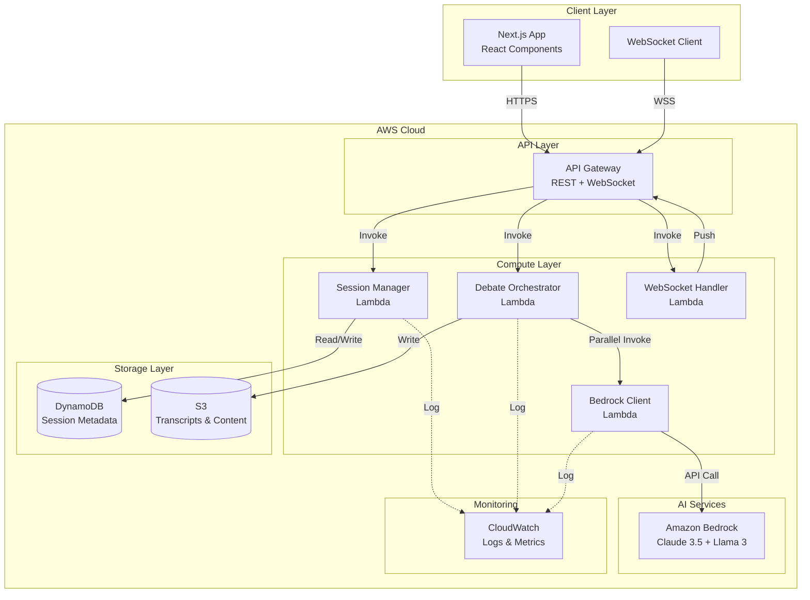

# Design Document: COUNCIL Next.js Serverless Migration

## Overview

This design document outlines the technical architecture for migrating the COUNCIL multi-agent AI editorial boardroom from static HTML prototypes to a production-ready Next.js application with fully serverless AWS backend infrastructure.

### System Goals

- Migrate existing HTML/CSS/JavaScript prototypes to a modern Next.js React application
- Implement a fully serverless AWS backend using Lambda, API Gateway, Bedrock, S3, and DynamoDB
- Enable real-time streaming of AI agent debates through WebSocket connections
- Provide a scalable, cost-effective architecture that handles concurrent users
- Maintain the existing visual design and user experience while adding production capabilities

### Key Design Principles

1. **Serverless-First**: All backend logic runs on AWS Lambda with no server management
2. **Real-Time Experience**: WebSocket streaming provides live debate updates as agents generate responses
3. **Type Safety**: TypeScript throughout the stack with runtime validation
4. **Separation of Concerns**: Clear boundaries between frontend, API layer, orchestration, and AI services
5. **Resilience**: Graceful error handling, retry logic, and connection recovery
6. **Cost Optimization**: ARM64 Lambda, on-demand DynamoDB, S3 lifecycle policies

## Architecture

### High-Level System Architecture



### Component Interaction Flow

#### Debate Workflow Sequence

```mermaid
sequenceDiagram
    participant User
    participant NextJS as Next.js Frontend
    participant APIGW as API Gateway
    participant Session as Session Manager
    participant Orch as Orchestrator
    participant Bedrock as Bedrock Client
    participant AI as Amazon Bedrock
    participant WS as WebSocket Handler
    participant DDB as DynamoDB
    participant S3
    
    User->>NextJS: Submit prompt
    NextJS->>APIGW: POST /api/sessions/start
    APIGW->>Session: Invoke
    Session->>DDB: Create session record
    Session-->>NextJS: Return session_id
    
    NextJS->>APIGW: Connect