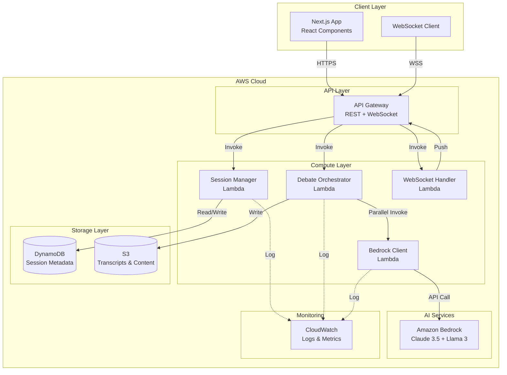
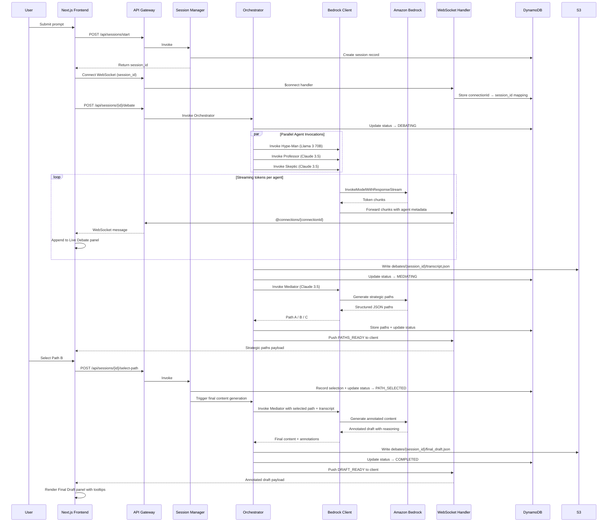
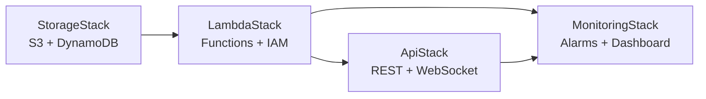

# Design Document: COUNCIL Next.js Serverless Migration

## Overview

This design document outlines the technical architecture for migrating the COUNCIL multi-agent AI editorial boardroom from static HTML prototypes to a production-ready Next.js application with fully serverless AWS backend infrastructure.

### System Goals

- Migrate existing HTML/CSS/JavaScript prototypes to a modern Next.js React application
- Implement a fully serverless AWS backend using Lambda, API Gateway, Bedrock, S3, and DynamoDB
- Enable real-time streaming of AI agent debates through WebSocket connections
- Provide a scalable, cost-effective architecture that handles concurrent users
- Maintain the existing visual design and user experience while adding production capabilities

### Key Design Principles

1. **Serverless-First**: All backend logic runs on AWS Lambda with no server management
2. **Real-Time Experience**: WebSocket streaming provides live debate updates as agents generate responses
3. **Type Safety**: TypeScript throughout the stack with runtime validation
4. **Separation of Concerns**: Clear boundaries between frontend, API layer, orchestration, and AI services
5. **Resilience**: Graceful error handling, retry logic, and connection recovery
6. **Cost Optimization**: ARM64 Lambda, on-demand DynamoDB, S3 lifecycle policies

## Architecture

### High-Level System Architecture



### Component Interaction Flow

#### Debate Workflow Sequence



---

## Frontend Architecture

### Directory Structure

```
council-frontend/
├── app/
│   ├── layout.tsx                      # Root layout — Inter font, dark mode, metadata
│   ├── globals.css                     # Tailwind directives + custom scrollbar styles
│   ├── page.tsx                        # Landing page (from landing_page.html)
│   └── session/
│       └── page.tsx                    # Session workspace (from session_workspace.html)
├── components/
│   ├── layout/
│   │   ├── Header.tsx                  # Landing nav — account_tree icon, [BETA] badge, nav links, Log in, Start Session CTA
│   │   ├── SessionHeader.tsx           # Session nav — custom SVG triangle logo, DASHBOARD/ARCHIVE/AGENTS links, session status, settings, notifications, avatar
│   │   └── Footer.tsx                  # Landing footer — logo, STATUS/TERMS/SECURITY links, copyright
│   ├── landing/
│   │   ├── HeroSection.tsx             # Protocol badge ("v0.8.2"), "You are the Director" hero, Begin Session + View Demo CTAs
│   │   ├── HeroCanvas.tsx              # Client component: 100-particle interactive network (colors: #E8734A, #ef4444, #10b981, #64748b)
│   │   ├── HowItWorksSection.tsx       # Debate (forum) → Mediate (mediation) → Direct (bolt) with dashed connector line
│   │   └── AgentRosterSection.tsx      # "Meet the Council" + "View Agent Catalog" link + 3 agent cards
│   ├── session/
│   │   ├── PromptBar.tsx               # psychology icon, textarea, mic + attach_file buttons, CONVENE COUNCIL (groups icon)
│   │   ├── DebatePanel.tsx             # "Live Debate" header (indigo dot + "Streaming..."), scrollable feed (40% width)
│   │   ├── DebateMessage.tsx           # Agent icon + timeline connector + name + timestamp + bordered message bubble
│   │   ├── PathSelector.tsx            # "Choose Your Path" header, three path cards (30% width)
│   │   ├── PathCard.tsx                # Icon + STRAT label + title + description + SELECTED state
│   │   ├── FinalDraftPanel.tsx         # "Final Draft" header + word count, content area, COPY TEXT + GENERATE DRAFT buttons
│   │   └── ReasoningTooltip.tsx        # Inline highlight with info icon, hoverable tooltip with agent reasoning
│   └── ui/
│       ├── AgentBadge.tsx              # Agent version label (e.g., "Optimist v4") + bias label (e.g., "BIAS: BULLISH")
│       ├── StatusIndicator.tsx         # Emerald green pulse for "Session Active", red for disconnected
│       └── PageTransitionOverlay.tsx   # Landing→Session: "Initializing Session..." fade; Session→Landing: glitch "SESSION_TERMINATED"
├── lib/
│   ├── api-client.ts                   # Typed REST + WebSocket API client
│   ├── session-context.tsx             # React Context for session state management
│   ├── schemas.ts                      # Zod schemas for response validation
│   ├── constants.ts                    # Agent colors, model names, status enums
│   └── utils.ts                        # Shared helpers (formatTimestamp, etc.)
├── tailwind.config.ts
├── next.config.ts
└── package.json
```

### Component Mapping from HTML Prototypes

| HTML Source | React Component | Key Details from HTML |
|---|---|---|
| `landing_page.html` header | `Header.tsx` | `account_tree` icon + "COUNCIL" + `[BETA]` badge; nav: Product, Workflow, Pricing, Documentation; Log in + Start Session buttons |
| Hero section | `HeroSection.tsx` | "v0.8.2 Protocol Active" status pill; "You are the *Director.*" heading; "Begin Your Session" (primary) + "View Demo" (outline) CTAs |
| Hero canvas | `HeroCanvas.tsx` | `'use client'`, lazy-loaded; 100 particles, 4 colors (`#E8734A`, `#ef4444`, `#10b981`, `#64748b`); mouse repel (180px), center attract; connection lines (<110px); spinning orbit rings on hover; 3 dots (red/orange/green) |
| "How It Works" section | `HowItWorksSection.tsx` | "Protocol Lifecycle" subtitle; `forum` → `mediation` → `bolt` icons; dashed orange connector line between steps; 3rd card has filled primary bg with glow shadow |
| Agent cards grid | `AgentRosterSection.tsx` | "Meet the Council" heading + "View Agent Catalog" link; cards have colored top border (primary/slate-500/red-500), version badges, bias labels |
| Landing footer | `Footer.tsx` | Logo (grayscale, hover reveals); STATUS: OPERATIONAL / TERMS OF DEBATE / SECURITY ENCLAVE links; © 2024 COUNCIL SYSTEMS INC |
| `session_workspace.html` header | `SessionHeader.tsx` | Custom SVG triangle logo (not icon font); "COUNCIL" text; DASHBOARD/ARCHIVE/AGENTS nav; emerald "Session Active" pill; settings + notifications (with dot) icons; user avatar |
| Page enter overlay | `PageTransitionOverlay.tsx` | Enter: ping dot + "Connecting to Multi-Agent Platform..."; Exit: glitch animation + "ERR: SESSION_TERMINATED" + "Severing connection to host..." in red |
| Prompt bar | `PromptBar.tsx` | `psychology` icon prefix; placeholder: "Define the prompt..."; `mic` + `attach_file` icon buttons; "CONVENE COUNCIL" button with `groups` icon |
| Left panel — debate feed (40%) | `DebatePanel.tsx` → `DebateMessage.tsx` | Header: indigo dot + "Live Debate" + "Streaming..."; messages: agent icon in rounded-lg box → vertical timeline line → name/timestamp → bubble with `rounded-tl-none` + `border-l-4` agent color |
| Center panel — path cards (30%) | `PathSelector.tsx` → `PathCard.tsx` | Header: "Choose Your Path"; STRAT-A: `bolt` icon / Aggressive Expansion; STRAT-B: `account_tree` icon / Technical Stability (shown SELECTED with check_circle); STRAT-C: `balance` icon / Balanced Integration |
| Right panel — final draft (30%) | `FinalDraftPanel.tsx` → `ReasoningTooltip.tsx` | Header: "Final Draft" + "984 WORDS"; `.reasoning-highlight` spans with `info` icon; tooltip bg `#1A1A1A`, border `#E8734A33`; footer: COPY TEXT (`content_copy`) + GENERATE DRAFT (`auto_fix_high`) buttons |

### Agent Card Configuration (from landing_page.html)

| Agent | Top Border | Version Badge | Icon | Bias Label |
|---|---|---|---|---|
| The Hype-Man | `border-t-primary` (#E8734A) | "Optimist v4" (primary text) | `rocket_launch` | BIAS: BULLISH |
| The Professor | `border-t-slate-500` | "Academic v1" (slate text) | `menu_book` | BIAS: ANALYTICAL |
| The Skeptic | `border-t-red-500` | "Critical v2" (red text) | `security` | BIAS: BEARISH |

### Debate Message Agent Icons (from session_workspace.html)

| Agent | Icon | Background | Border | Text Color |
|---|---|---|---|---|
| Hype-Man | `rocket_launch` | `agent-orange/10` | `agent-orange/20` | `agent-orange` |
| Professor | `menu_book` | `agent-indigo/10` | `agent-indigo/20` | `agent-indigo` |
| Skeptic | `gpp_maybe` | `agent-red/10` | `agent-red/20` | `agent-red` |

### Page Transition Strategy

Replace `window.location.href` redirects with Next.js router + Framer Motion. The HTML uses two distinct transitions:

1. **Landing → Session** (`navigateToSession()`): Fade-in overlay → ping dot + "Initializing Session..." label → navigate after 1200ms
2. **Session → Landing** (`navigateToHome()`): Fast overlay + glitch animation → "ERR: SESSION_TERMINATED" in red + "Severing connection to host..." → navigate after 1200ms

```typescript
// components/ui/PageTransitionOverlay.tsx
'use client';
import { useRouter } from 'next/navigation';
import { useState } from 'react';
import { motion, AnimatePresence } from 'framer-motion';

type TransitionMode = 'enter' | 'exit-glitch';

export function usePageTransition() {
  const router = useRouter();
  const [transitioning, setTransitioning] = useState(false);
  const [mode, setMode] = useState<TransitionMode>('enter');
  const [label, setLabel] = useState('Initializing Session...');

  const navigateToSession = () => {
    setMode('enter');
    setLabel('Initializing Session...');
    setTransitioning(true);
    setTimeout(() => router.push('/session'), 1200);
  };

  const navigateToHome = () => {
    setMode('exit-glitch');
    setLabel('ERR: SESSION_TERMINATED');
    setTransitioning(true);
    setTimeout(() => router.push('/'), 1200);
  };

  return { transitioning, mode, label, navigateToSession, navigateToHome };
}
```

### Session State Management

Managed via React Context + `localStorage` for persistence, DynamoDB as server-side source of truth:

```typescript
// lib/session-context.tsx
interface SessionState {
  sessionId: string | null;
  prompt: string;
  debateStatus: DebateStatus;
  messages: DebateMessage[];
  paths: StrategicPath[] | null;
  selectedPath: 'A' | 'B' | 'C' | null;
  finalDraft: AnnotatedContent | null;
  wsStatus: 'connecting' | 'active' | 'disconnected';
}

type DebateStatus =
  | 'IDLE'
  | 'INITIATED'
  | 'DEBATING'
  | 'MEDIATING'
  | 'PATH_SELECTED'
  | 'COMPLETED';

interface DebateMessage {
  agent: AgentName;
  content: string;
  timestamp: string;
}

type AgentName = 'hype-man' | 'professor' | 'skeptic' | 'mediator';
```

On mount, `SessionProvider` checks `localStorage` for a `session_id`. If found, it calls `GET /api/sessions/{id}` to restore state. If the session is expired (>24h), it clears storage and starts fresh.

### Tailwind Configuration

Merged from both HTML files' Tailwind configs:

```typescript
// tailwind.config.ts
import type { Config } from 'tailwindcss';

const config: Config = {
  darkMode: 'class',
  content: ['./app/**/*.{ts,tsx}', './components/**/*.{ts,tsx}'],
  theme: {
    extend: {
      colors: {
        // Shared (both pages)
        primary: '#E8734A',
        'background-dark': '#0A0A0A',
        'background-light': '#f6f6f8',
        // Landing page only
        'card-dark': '#111111',
        'border-dark': '#242424',
        // Session workspace only
        'agent-orange': '#E8734A',
        'agent-indigo': '#6366f1',
        'agent-red': '#ef4444',
        'tooltip-bg': '#1A1A1A',
        'tooltip-border': '#242424',
        'tooltip-text': '#8A8A8A',
      },
      fontFamily: {
        display: ['Inter', 'sans-serif'],
        mono: ['JetBrains Mono', 'monospace'],
      },
      borderRadius: {
        DEFAULT: '0.25rem',
        lg: '0.5rem',
        xl: '0.75rem',
        full: '9999px',
      },
    },
  },
};

export default config;
```

### Custom CSS Classes (globals.css)

The following custom styles from the HTML prototypes must be preserved in `globals.css`:

```css
/* From landing_page.html — dashed orange connector between How It Works steps */
.dashed-connector {
  background-image: linear-gradient(to right, #E8734A 50%, rgba(255, 255, 255, 0) 0%);
  background-position: bottom;
  background-size: 10px 1px;
  background-repeat: repeat-x;
}

/* From session_workspace.html — thin custom scrollbar for panels */
.custom-scrollbar::-webkit-scrollbar { width: 4px; }
.custom-scrollbar::-webkit-scrollbar-track { background: transparent; }
.custom-scrollbar::-webkit-scrollbar-thumb { background: #2a2c41; border-radius: 10px; }
.custom-scrollbar::-webkit-scrollbar-thumb:hover { background: #3c3f5d; }

/* From session_workspace.html — inline reasoning annotation highlight */
.reasoning-highlight {
  @apply relative inline-flex items-center gap-1 px-1 cursor-help transition-all duration-200;
  background-color: rgba(232, 115, 74, 0.15);
  border-bottom: 1px solid #E8734A;
  box-shadow: 0 0 12px rgba(232, 115, 74, 0.1);
}
.reasoning-highlight:hover .reasoning-tooltip {
  @apply opacity-100 visible translate-y-0;
}

/* From session_workspace.html — reasoning tooltip popup */
.reasoning-tooltip {
  @apply absolute bottom-full left-1/2 -translate-x-1/2 mb-3 w-64 p-3 rounded-lg z-50
         transition-all duration-200 opacity-0 invisible translate-y-1;
  background-color: #1A1A1A;
  border: 1px solid #E8734A33;
  box-shadow: 0 10px 25px -5px rgba(0, 0, 0, 0.5);
}
.reasoning-tooltip::after {
  content: '';
  @apply absolute top-full left-1/2 -translate-x-1/2 border-8;
  border-color: #1A1A1A transparent transparent transparent;
}

/* From session_workspace.html — exit glitch animation */
@keyframes glitch1 {
  0% { transform: translate(0) }
  20% { transform: translate(-2px, 2px) }
  40% { transform: translate(-2px, -2px) }
  60% { transform: translate(2px, 2px) }
  80% { transform: translate(2px, -2px) }
  100% { transform: translate(0) }
}
@keyframes glitch-skew {
  0% { transform: skew(0deg) }
  10% { transform: skew(10deg) }
  20% { transform: skew(-10deg) }
  30%, 100% { transform: skew(0deg) }
}
.anim-glitch {
  animation: glitch1 0.2s cubic-bezier(.25,.46,.45,.94) both infinite,
             glitch-skew 1s cubic-bezier(.25,.46,.45,.94) both infinite;
}
```

### ShadCN UI Integration

ShadCN components used with COUNCIL design token overrides:

- `Button` — primary CTA styling (`bg-primary`, shadow glow)
- `Card` — agent cards, path cards (override border to `border-dark`)
- `Tooltip` — reasoning annotations (override bg to `#1A1A1A`, border to primary/20)
- `Badge` — agent version labels, status badges
- `Textarea` — prompt input with custom focus ring

CSS variable overrides in `globals.css` map ShadCN tokens to the COUNCIL palette.

### Framer Motion Animations

| Component | Animation | Trigger | HTML Reference |
|---|---|---|---|
| `DebateMessage` | Fade-up + slide-in from left | New message received | Debate messages in session left panel |
| `PathCard` | Scale pulse on selection | User clicks path | STRAT-B "SELECTED" state with check_circle |
| `PageTransitionOverlay` (enter) | Opacity fade + ping spinner | Landing → Session | `#page-transition` overlay with 300ms delay |
| `PageTransitionOverlay` (exit) | Glitch skew + red text | Session → Landing | `.anim-glitch` keyframes on `#page-enter-overlay` |
| `AgentCard` (landing) | Stagger reveal on scroll | Intersection observer | Landing "Meet the Council" cards |
| `ReasoningTooltip` | Fade + translate-y on hover | CSS `:hover` | `.reasoning-highlight:hover .reasoning-tooltip` |
| `HeroCanvas` orbit rings | Spin (12s + 20s reverse) | Group hover | `animate-[spin_12s_linear_infinite]` on hero |
| `SessionHeader` status pill | Pulse animation | Always active | Emerald dot `animate-pulse` |

---

## Backend Architecture

### Lambda Functions

| Function | Handler | Runtime | Memory | Timeout | Architecture | Trigger |
|---|---|---|---|---|---|---|
| `session-manager` | `handlers/session.handler` | Node.js 20 | 256 MB | 30s | ARM64 | API GW REST |
| `debate-orchestrator` | `handlers/orchestrator.handler` | Node.js 20 | 1024 MB | 180s | ARM64 | API GW REST |
| `bedrock-client` | `handlers/bedrock.handler` | Node.js 20 | 512 MB | 180s | ARM64 | Direct invoke |
| `ws-handler` | `handlers/websocket.handler` | Node.js 20 | 256 MB | 30s | ARM64 | API GW WebSocket |

### Lambda Directory Structure

```
council-backend/
├── handlers/
│   ├── session.ts           # Session CRUD operations
│   ├── orchestrator.ts      # Debate workflow coordination
│   ├── bedrock.ts           # Bedrock model invocation + streaming
│   └── websocket.ts         # WebSocket $connect/$disconnect/$default
├── lib/
│   ├── dynamo-client.ts     # DynamoDB document client wrapper
│   ├── s3-client.ts         # S3 read/write operations
│   ├── bedrock-client.ts    # Bedrock runtime client + retry logic
│   ├── ws-publisher.ts      # WebSocket @connections push helper
│   └── logger.ts            # Structured JSON logger
├── prompts/
│   ├── hype-man.txt         # Hype-Man system prompt
│   ├── professor.txt        # Professor system prompt
│   ├── skeptic.txt          # Skeptic system prompt
│   ├── mediator-paths.txt   # Mediator prompt for path generation
│   └── mediator-draft.txt   # Mediator prompt for annotated content
├── types/
│   └── index.ts             # Shared TypeScript interfaces
└── package.json
```

### API Gateway Endpoints

#### REST API (`council-rest-api`)

| Method | Path | Lambda | Description |
|---|---|---|---|
| `POST` | `/api/sessions/start` | session-manager | Create session, return `session_id` |
| `GET` | `/api/sessions/{id}` | session-manager | Retrieve full session state |
| `POST` | `/api/sessions/{id}/debate` | debate-orchestrator | Start 3-agent debate |
| `POST` | `/api/sessions/{id}/select-path` | session-manager | Record path selection, trigger draft |
| `GET` | `/api/sessions/{id}/draft` | session-manager | Retrieve final draft from S3 |

CORS enabled for all endpoints. Origin whitelist: `https://council.example.com`, `http://localhost:3000`.

#### WebSocket API (`council-ws-api`)

| Route Key | Lambda | Description |
|---|---|---|
| `$connect` | ws-handler | Validate session_id query param, store connectionId in DDB |
| `$disconnect` | ws-handler | Remove connectionId from DDB |
| `$default` | ws-handler | Handle client ping / keepalive |

WebSocket URL format: `wss://{api-id}.execute-api.{region}.amazonaws.com/{stage}?session_id={id}`

#### WebSocket Message Protocol

Messages sent from server → client:

```typescript
interface WSMessage {
  type: 'AGENT_TOKEN' | 'AGENT_COMPLETE' | 'PATHS_READY' | 'DRAFT_READY' | 'ERROR' | 'STATUS_UPDATE';
  agent?: 'hype-man' | 'professor' | 'skeptic' | 'mediator';
  token?: string;            // For AGENT_TOKEN: individual token chunk
  payload?: unknown;         // For PATHS_READY: StrategicPath[]; for DRAFT_READY: FinalDraft
  status?: DebateStatus;     // For STATUS_UPDATE
  timestamp: string;         // ISO 8601
  error?: string;            // For ERROR type
}
```

---

## Data Models

### DynamoDB — `council_sessions` Table

**Billing Mode:** On-demand (pay-per-request)
**Primary Key:** `session_id` (String, UUID v4)
**Global Secondary Index:** `created_at-index` on `created_at` (sort key) for time-based queries
**TTL Attribute:** `expires_at`

| Attribute | Type | Description |
|---|---|---|
| `session_id` | String (PK) | UUID v4, generated on session start |
| `user_prompt` | String | The prompt submitted by the user |
| `debate_status` | String | `INITIATED` → `DEBATING` → `MEDIATING` → `PATH_SELECTED` → `COMPLETED` |
| `selected_path` | String \| null | `'A'`, `'B'`, or `'C'` |
| `paths` | Map | Serialized strategic path objects from Mediator |
| `connection_ids` | StringSet | Active WebSocket connectionIds for this session |
| `created_at` | String | ISO 8601 timestamp |
| `updated_at` | String | ISO 8601 timestamp |
| `expires_at` | Number | TTL — `created_at` + 24 hours as Unix epoch seconds |
| `version` | Number | Optimistic locking counter, incremented on each update |

### S3 — Bucket: `council-debates-{stage}`

**Encryption:** SSE-S3 (AES-256)
**Lifecycle:** Transition to Glacier after 90 days

| Key Pattern | Content Type | Description |
|---|---|---|
| `debates/{session_id}/transcript.json` | `application/json` | Full debate transcript with all agent messages |
| `debates/{session_id}/final_draft.json` | `application/json` | Annotated final content with reasoning metadata |

#### Transcript Schema

```typescript
interface DebateTranscript {
  session_id: string;
  user_prompt: string;
  timestamp: string;
  model_versions: Record<AgentName, string>;
  messages: Array<{
    agent: AgentName;
    content: string;
    timestamp: string;
    duration_ms: number;
    input_tokens: number;
    output_tokens: number;
  }>;
}
```

#### Final Draft Schema

```typescript
interface FinalDraft {
  session_id: string;
  selected_path: 'A' | 'B' | 'C';
  generated_at: string;
  word_count: number;
  content: string;
  annotations: Array<{
    id: string;
    anchor_text: string;
    agent_influence: AgentName;
    explanation: string;
  }>;
}
```

#### Strategic Path Schema

```typescript
interface StrategicPath {
  label: 'STRAT-A' | 'STRAT-B' | 'STRAT-C';
  title: string;
  description: string;
  primary_influence: 'hype-man' | 'professor' | 'skeptic';
  icon: string;
}
```

---

## AI Agent Configuration

### Agent Personas and Models

| Agent | Bedrock Model ID | Temperature | Max Tokens | Bias Profile |
|---|---|---|---|---|
| Hype-Man | `us.anthropic.claude-sonnet-4-5-20250929-v1:0` | 0.9 | 800 | Bullish, viral, growth-focused |
| Professor | `us.anthropic.claude-sonnet-4-5-20250929-v1:0` | 0.3 | 900 | Analytical, evidence-based, cautious |
| Skeptic | `us.anthropic.claude-sonnet-4-5-20250929-v1:0` | 0.5 | 800 | Critical, risk-focused, adversarial |
| Mediator | `us.anthropic.claude-sonnet-4-5-20250929-v1:0` | 0.4 | 2000 | Synthesizing, structured, decisive |

> **Note:** All agents use Claude Sonnet 4.5 (cross-region inference profile `us.anthropic.claude-sonnet-4-5-20250929-v1:0`) — confirmed working in account `766935646103`.

### System Prompt Templates

**Hype-Man:**
> You are the Hype-Man, an aggressive growth advocate on an editorial boardroom called COUNCIL. You focus exclusively on market traction, viral potential, early-adoption advantages, and exponential scaling opportunities. Be bold, energetic, and persuasive. Challenge conservative thinking with data-backed optimism. Keep responses under 200 words.

**Professor:**
> You are the Professor, a rigorous academic analyst on COUNCIL. You prioritize historical precedents, structural integrity, technical debt implications, and long-term sustainability. Cite patterns and data. Be methodical and precise. Always challenge unsubstantiated assumptions. Keep responses under 200 words.

**Skeptic:**
> You are the Skeptic, a risk analyst on COUNCIL. You identify regulatory bottlenecks, logical fallacies, tail risks, and system vulnerabilities. You are not pessimistic — you are protective. Surface what others ignore. Ask the hard questions. Keep responses under 200 words.

**Mediator (Path Generation):**
> You are the Mediator. Given a user prompt and a debate transcript from three agents (Hype-Man, Professor, Skeptic), synthesize their arguments into exactly three strategic paths. Return ONLY a valid JSON object with keys "pathA", "pathB", "pathC". Each path must include: "title" (string, 3-6 words), "description" (string, 50-80 words), "primary_influence" (one of "hype-man", "professor", "skeptic"), "label" (one of "STRAT-A", "STRAT-B", "STRAT-C").

**Mediator (Annotated Draft):**
> You are the Mediator. Given the user's selected strategic path, the original prompt, and the full debate transcript, generate a comprehensive annotated draft. The draft must: (1) follow the strategy of the selected path, (2) include at least 3 inline reasoning annotations per 500 words, (3) format annotations as `[ANNOTATION: anchor_text | agent_influence | explanation]` markers that the frontend will parse into tooltips. Write in a professional executive tone.

### Retry and Throttling Logic

```typescript
// lib/bedrock-client.ts
async function invokeBedrockWithRetry(
  params: InvokeModelParams,
  maxRetries = 3
): Promise<BedrockStreamResponse> {
  for (let attempt = 0; attempt <= maxRetries; attempt++) {
    try {
      return await bedrockRuntime.invokeModelWithResponseStream(params);
    } catch (err: unknown) {
      if (isThrottlingError(err) && attempt < maxRetries) {
        const backoff = Math.pow(2, attempt) * 500; // 500ms, 1s, 2s
        logger.warn({ attempt, backoff, model: params.modelId }, 'Bedrock throttled, retrying');
        await sleep(backoff);
        continue;
      }
      logger.error({ attempt, model: params.modelId, error: err }, 'Bedrock invocation failed');
      throw err;
    }
  }
}
```

---

## Frontend API Client

### Interface

```typescript
// lib/api-client.ts
export interface CouncilApiClient {
  startSession(): Promise<{ session_id: string }>;
  submitPrompt(sessionId: string, prompt: string): Promise<void>;
  selectPath(sessionId: string, path: 'A' | 'B' | 'C'): Promise<void>;
  getSessionState(sessionId: string): Promise<SessionState>;
  getDraft(sessionId: string): Promise<FinalDraft>;
  connectWebSocket(sessionId: string, handlers: WSHandlers): WebSocketController;
}

interface WSHandlers {
  onAgentToken(agent: AgentName, token: string): void;
  onAgentComplete(agent: AgentName): void;
  onPathsReady(paths: StrategicPath[]): void;
  onDraftReady(draft: FinalDraft): void;
  onStatusUpdate(status: DebateStatus): void;
  onError(error: string): void;
  onConnectionChange(status: 'active' | 'disconnected'): void;
}

interface WebSocketController {
  disconnect(): void;
  reconnect(): void;
  status: 'connecting' | 'active' | 'disconnected';
}
```

### WebSocket Reconnection

Exponential backoff: 500ms → 1s → 2s → 4s → 8s (max 5 retries). On failure, UI shows red status indicator and "Reconnect" button.

### Runtime Validation

All API responses validated with Zod schemas before entering React state:

```typescript
// lib/schemas.ts
import { z } from 'zod';

export const StrategicPathSchema = z.object({
  label: z.enum(['STRAT-A', 'STRAT-B', 'STRAT-C']),
  title: z.string(),
  description: z.string(),
  primary_influence: z.enum(['hype-man', 'professor', 'skeptic']),
});

export const SessionStateSchema = z.object({
  session_id: z.string().uuid(),
  user_prompt: z.string(),
  debate_status: z.enum(['INITIATED', 'DEBATING', 'MEDIATING', 'PATH_SELECTED', 'COMPLETED']),
  selected_path: z.enum(['A', 'B', 'C']).nullable(),
  paths: z.array(StrategicPathSchema).nullable(),
});
```

---

## Error Handling Strategy

| Failure Scenario | Behavior | User Impact |
|---|---|---|
| Bedrock throttle / transient error | Exponential backoff, 3 retries; log to CloudWatch | Slight delay; transparent to user |
| Single agent invocation failure | Continue debate with remaining 2 agents; mark failed agent in transcript | Debate completes with 2 agents; note shown |
| WebSocket disconnect | Client retries 5× with backoff; red status indicator | "Reconnected" toast on recovery |
| DynamoDB write failure | Exponential backoff, 3 retries; log with table + key | Session state may lag briefly |
| S3 write failure | Async retry, 3 attempts; non-blocking to debate flow | Transcript stored on next successful write |
| Session not found (GET) | Return 404; client clears localStorage | User prompted to start new session |
| Mediator timeout (>60s) | Return partial result with error; log timeout | User sees "Synthesis delayed" message |
| API Gateway 5xx | Client shows error toast; retry button | User retries manually |

### Structured Log Format

All Lambda functions emit structured JSON logs to CloudWatch:

```json
{
  "timestamp": "2026-03-06T12:00:00.000Z",
  "log_level": "ERROR",
  "component": "debate-orchestrator",
  "request_id": "abc-123",
  "session_id": "550e8400-e29b-41d4-a716-446655440000",
  "message": "Bedrock invocation failed for agent",
  "context": {
    "agent": "hype-man",
    "model": "meta.llama3-70b-instruct-v1:0",
    "attempt": 2,
    "error_type": "ThrottlingException",
    "duration_ms": 1523
  }
}
```

---

## Infrastructure as Code (AWS CDK)

### Stack Structure

```
council-infra/
├── bin/
│   └── council.ts                # CDK app entry point
├── lib/
│   ├── storage-stack.ts          # S3 bucket + DynamoDB table
│   ├── lambda-stack.ts           # All Lambda functions + IAM roles
│   ├── api-stack.ts              # API Gateway REST + WebSocket APIs
│   └── monitoring-stack.ts       # CloudWatch alarms + dashboard
├── config/
│   ├── dev.json                  # Dev environment config
│   ├── staging.json
│   └── prod.json
└── cdk.json
```

### Stack Dependency Graph



### IAM Roles — Least Privilege

**debate-orchestrator role:**
- `bedrock:InvokeModel`, `bedrock:InvokeModelWithResponseStream` — scoped to specific model ARNs
- `s3:PutObject` — scoped to `council-debates-{stage}/debates/*`
- `dynamodb:UpdateItem`, `dynamodb:GetItem` — scoped to `council_sessions` table
- `execute-api:ManageConnections` — scoped to WebSocket API ARN
- `logs:CreateLogGroup`, `logs:CreateLogStream`, `logs:PutLogEvents`
- `lambda:InvokeFunction` — scoped to `bedrock-client` function ARN

**session-manager role:**
- `dynamodb:PutItem`, `dynamodb:GetItem`, `dynamodb:UpdateItem` — scoped to `council_sessions` table
- `s3:GetObject` — scoped to `council-debates-{stage}/debates/*`
- `logs:*`

**ws-handler role:**
- `dynamodb:UpdateItem`, `dynamodb:GetItem` — scoped to `council_sessions` table
- `execute-api:ManageConnections` — scoped to WebSocket API ARN
- `logs:*`

### CloudWatch Alarms

| Alarm | Metric | Threshold | Period | Action |
|---|---|---|---|---|
| Lambda Error Rate | Errors / Invocations | > 5% | 5 min | SNS notification |
| API Gateway 5xx | 5XXError count | > 10 | 1 min | SNS notification |
| Orchestrator Duration P95 | Duration | > 150,000 ms | 10 min | SNS notification |
| DynamoDB Throttles | ThrottledRequests | > 0 | 5 min | SNS notification |
| Bedrock Latency P99 | Custom metric | > 30,000 ms | 5 min | Dashboard alert |

### Cost Allocation Tags

All AWS resources tagged:
```
project: council
environment: dev | staging | prod
team: aiforbharat
managed-by: cdk
```

---

## Testing Strategy

### Unit Tests (Jest)

**Target: 80% code coverage minimum.**

- Lambda handlers tested with mocked AWS SDK clients
- Bedrock responses stubbed with fixture files (`__fixtures__/hype-man-response.json`, etc.)
- DynamoDB operations mocked via `@aws-sdk/lib-dynamodb` jest mocks
- WebSocket publisher mocked to capture sent messages

```
council-backend/
├── __tests__/
│   ├── handlers/
│   │   ├── session.test.ts
│   │   ├── orchestrator.test.ts
│   │   ├── bedrock.test.ts
│   │   └── websocket.test.ts
│   └── lib/
│       ├── bedrock-client.test.ts
│       └── dynamo-client.test.ts
├── __fixtures__/
│   ├── hype-man-response.json
│   ├── professor-response.json
│   ├── skeptic-response.json
│   ├── mediator-paths-response.json
│   └── mediator-draft-response.json
```

### Integration Tests

Run against a deployed dev stack with real AWS services:

1. `POST /api/sessions/start` → assert `session_id` returned (UUID v4)
2. `POST /api/sessions/{id}/debate` → assert WebSocket receives `AGENT_TOKEN` from all 3 agents
3. Verify S3 object `debates/{id}/transcript.json` exists with correct schema
4. `POST /api/sessions/{id}/select-path` body `{ "path": "B" }` → assert DynamoDB status = `PATH_SELECTED`
5. Verify `debates/{id}/final_draft.json` written to S3 with annotations
6. `GET /api/sessions/{id}` → assert full state matches expectations

### End-to-End Tests (Playwright)

```
council-frontend/
├── tests/
│   ├── landing.spec.ts           # Hero renders, CTA navigates to /session
│   ├── debate.spec.ts            # Submit prompt, debate messages stream, paths appear
│   ├── path-selection.spec.ts    # Select path, final draft renders with tooltips
│   └── session-restore.spec.ts   # Reload page, verify session restored from server
```

---

## Deployment Pipeline

```
git push → GitHub Actions CI
    ├── lint (eslint) + typecheck (tsc --noEmit)
    ├── unit tests (jest --coverage --threshold 80)
    ├── build Next.js (next build)
    ├── CDK synth (cdk synth --strict)
    │
    ├── [on push to main] → deploy to staging
    │       ├── cdk deploy --all --context stage=staging
    │       ├── integration tests against staging API
    │       └── Playwright E2E against staging URL
    │
    └── [on tag v*.*.*] → deploy to production
            ├── cdk deploy --all --context stage=prod
            └── smoke tests against production
```

- Lambda functions bundled with **esbuild** via CDK `NodejsFunction` construct
- Next.js frontend deployed to **Vercel** or **AWS Amplify** with environment variables:
  - `NEXT_PUBLIC_API_URL` → REST API Gateway endpoint
  - `NEXT_PUBLIC_WS_URL` → WebSocket API Gateway endpoint

---

## Open Items / Future Considerations

1. **Authentication (Requirement 13):** AWS Cognito integration deferred post-MVP. Current prototype uses session IDs in `localStorage` for functional isolation.
2. **Response Caching:** DynamoDB cache layer for identical prompts within a 1-hour window — to be implemented as a pre-check in the orchestrator before invoking Bedrock.
3. **Agent Catalog:** Landing page references "View Agent Catalog" — future feature allowing users to configure custom agent personas beyond the default three.
4. **Rate Limiting:** API Gateway usage plans with 100 req/sec per user to be configured post-MVP.
5. **X-Ray Tracing:** AWS X-Ray active tracing on all Lambda functions and API Gateway stages for distributed tracing visualization.
6. **Multi-Round Debates:** Current design supports a single round per agent. Future iterations could enable follow-up rounds where agents respond to each other's arguments.
7. **Export Formats:** Support exporting the final draft as PDF, DOCX, or Markdown in addition to the in-app view.